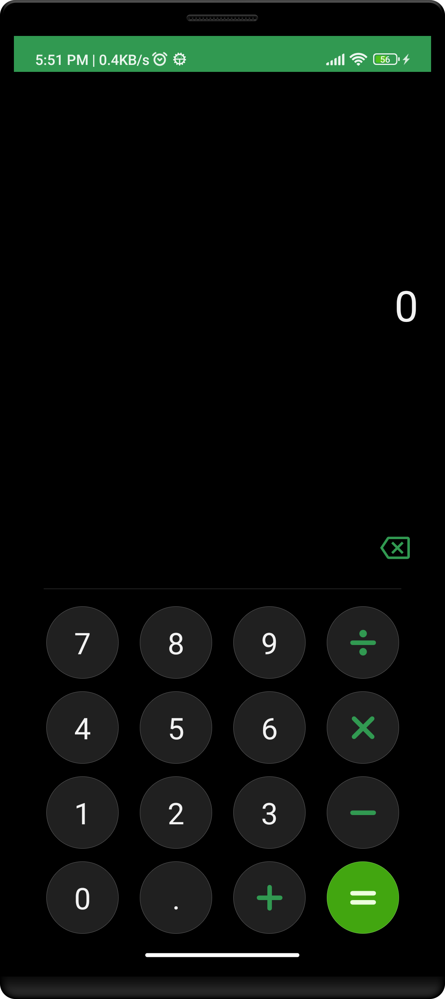

Calculator android app
=====================================
The app is entirely written in Kotlin and uses Jetpack Compose library for UI.

<table>
  <tr>
    <td></td>
    <td></td>
  </tr>
</table>
